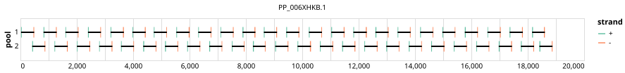

# artic-bdbv-2026 400bp v1.0.0


> If you use this scheme please cite: https://doi.org/10.62599/PP_SS_2014.1

> If you use this scheme please cite: https://pathoplexus.org/seq/PP_006XHL9.2

## Notes

This scheme was designed in response to the 2026 outbreak of Bundibugyo virus. It utilises restricted-access sequences from Pathoplexus (used with explicit author permission). The associated Pathoplexus SeqSet and DOI for these sequences can be found under the citations. For more information on data usage, please review the Pathoplexus Restricted Data Terms of Use: https://pathoplexus.org/about/terms-of-use/restricted-data

## Metadata

**Target Organisms:**
- Orthoebolavirus bundibugyoense (Tax ID: 3052458)

## Contributors

- ARTIC network
- INRB

## Overviews

<div style="width: 100%;"></div>

## Details

```json
{
    "schema_version": "1.0.0-alpha",
    "primer_scheme_name": "artic-bdbv-2026",
    "amplicon_size": 400,
    "primer_scheme_version": "v1.0.0",
    "primer_scheme_identifier": "artic-bdbv-2026/400/v1.0.0",
    "primer_scheme_contributor": [
        {
            "primer_scheme_contributor_name": "ARTIC network"
        },
        {
            "primer_scheme_contributor_name": "INRB"
        }
    ],
    "primer_scheme_target_organism": [
        {
            "primer_scheme_target_organism_name": "Orthoebolavirus bundibugyoense",
            "primer_scheme_target_organism_ncbi_taxon_id": "3052458"
        }
    ],
    "primer_scheme_license": "CC-BY-SA-4.0",
    "primer_scheme_development_status": "DRAFT",
    "citation": [
        "https://doi.org/10.62599/PP_SS_2014.1",
        "https://pathoplexus.org/seq/PP_006XHL9.2"
    ],
    "primer_scheme_details": [
        "This scheme was designed in response to the 2026 outbreak of Bundibugyo virus. It utilises restricted-access sequences from Pathoplexus (used with explicit author permission). The associated Pathoplexus SeqSet and DOI for these sequences can be found under the citations. For more information on data usage, please review the Pathoplexus Restricted Data Terms of Use: https://pathoplexus.org/about/terms-of-use/restricted-data"
    ],
    "primer_scheme_generator": {
        "primer_scheme_generator_name": "primalscheme3",
        "primer_scheme_generator_version": "3.3"
    },
    "primer_scheme_checksums": {
        "primer_scheme_sha256": "79c1a4d1d9563ce6f78c5a0bab65ef4f2ea446076400248900ab85b6c36a45c5",
        "reference_sequence_sha256": "70b500386c2c46555f5b983aaf683c6211ba360b47067e94b709ba34b4d1b4d1"
    },
    "primer_scheme_creation_date": "2026-05-28",
    "primer_scheme_submission_date": "2026-09-01"
}
```


------------------------------------------------------------------------

This work is licensed under a [Creative Commons Attribution-ShareAlike 4.0 International License](http://creativecommons.org/licenses/by-sa/4.0/).

