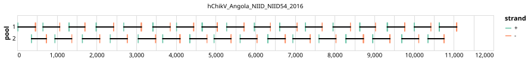

# artic-chikv-ecsa 400bp v1.0.0


## Metadata

**Target Organisms:**
- Chikungunya virus (Tax ID: 37124)

## Contributors

- quick-lab
- ARTIC network

## Overviews

<div style="width: 100%;"></div>

## Details

```json
{
    "schema_version": "1.0.0-alpha",
    "primer_scheme_name": "artic-chikv-ecsa",
    "amplicon_size": 400,
    "primer_scheme_version": "v1.0.0",
    "primer_scheme_identifier": "artic-chikv-ecsa/400/v1.0.0",
    "primer_scheme_contributor": [
        {
            "primer_scheme_contributor_name": "quick-lab"
        },
        {
            "primer_scheme_contributor_name": "ARTIC network"
        }
    ],
    "primer_scheme_target_organism": [
        {
            "primer_scheme_target_organism_name": "Chikungunya virus",
            "primer_scheme_target_organism_ncbi_taxon_id": "37124"
        }
    ],
    "primer_scheme_identifier_alias": [
        "artic-chikungunya-virus"
    ],
    "primer_scheme_license": "CC-BY-SA-4.0",
    "primer_scheme_development_status": "DRAFT",
    "primer_scheme_generator": {
        "primer_scheme_generator_name": "primalscheme3",
        "primer_scheme_generator_version": "3.0.3"
    },
    "primer_scheme_checksums": {
        "primer_scheme_sha256": "9a6bc87b98a59ca84dfe143f24de6f23bf18ac43621d5e505bea28abbff31cbd",
        "reference_sequence_sha256": "1717f232598af334f59d88c8f0d74f776ccae0d22b62b19f736b22ba111caa43"
    },
    "primer_scheme_creation_date": "2025-04-25",
    "primer_scheme_submission_date": "2026-09-01"
}
```


------------------------------------------------------------------------

This work is licensed under a [Creative Commons Attribution-ShareAlike 4.0 International License](http://creativecommons.org/licenses/by-sa/4.0/).

