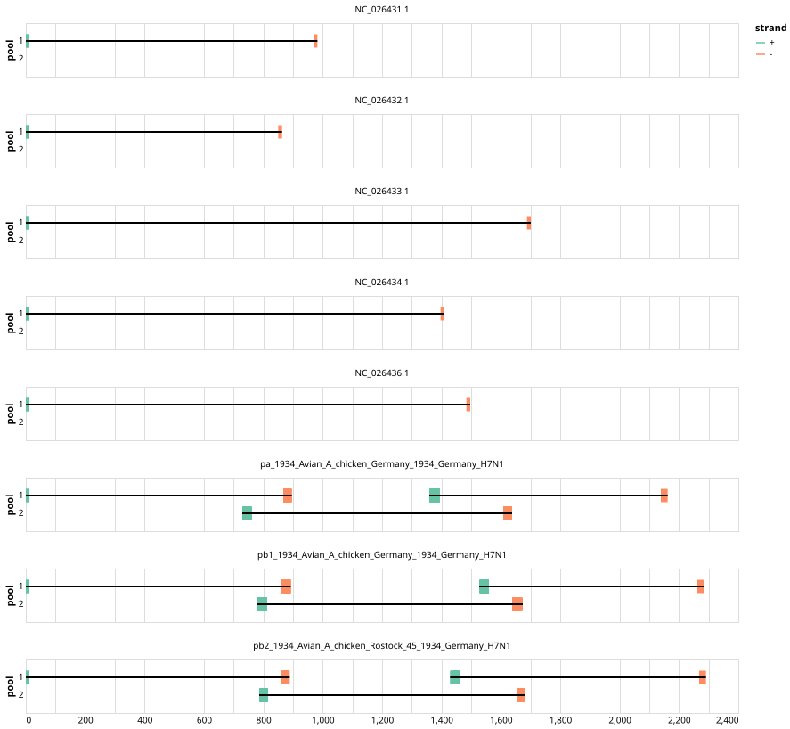

# artic-flu-a 800bp v1.0.0


## Notes

PrimerScheme for influenza A utilising tuni-primers alongside internal-primers for larger segments

## Metadata

**Target Organisms:**
- Influenza A virus (Tax ID: 11320)

## Contributors

- ARTIC network

## Overviews

<div style="width: 100%;"></div>

## Details

```json
{
    "schema_version": "1.0.0-alpha",
    "primer_scheme_name": "artic-flu-a",
    "amplicon_size": 800,
    "primer_scheme_version": "v1.0.0",
    "primer_scheme_identifier": "artic-flu-a/800/v1.0.0",
    "primer_scheme_contributor": [
        {
            "primer_scheme_contributor_name": "ARTIC network"
        }
    ],
    "primer_scheme_target_organism": [
        {
            "primer_scheme_target_organism_name": "Influenza A virus",
            "primer_scheme_target_organism_ncbi_taxon_id": "11320"
        }
    ],
    "primer_scheme_license": "CC-BY-SA-4.0",
    "primer_scheme_development_status": "DRAFT",
    "primer_scheme_details": [
        "PrimerScheme for influenza A utilising tuni-primers alongside internal-primers for larger segments"
    ],
    "primer_scheme_generator": {
        "primer_scheme_generator_name": "primalscheme3",
        "primer_scheme_generator_version": "3.2.0-artic-flu"
    },
    "primer_scheme_checksums": {
        "primer_scheme_sha256": "9187bf59d554e77270dd78bea1ea33c47086d17903c12308c19ded63b74b4f1e",
        "reference_sequence_sha256": "9db53b2bc28ba1a80eb35c8f6691ac6f604813ebcb64de42bf3e952be6d90d16"
    },
    "primer_scheme_creation_date": "2025-11-07",
    "primer_scheme_submission_date": "2026-09-01"
}
```


------------------------------------------------------------------------

This work is licensed under a [Creative Commons Attribution-ShareAlike 4.0 International License](http://creativecommons.org/licenses/by-sa/4.0/).

