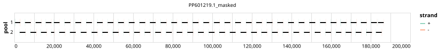

# artic-inrb-mpox 2500bp v1.0.0-cladeib


## Notes

Clade I genomes were aligned to clade I reference and Clade II genomes were aligned to clade II reference with squirrel. The two clades were consensus aligned using MAFFT and the alignment was used as the input for primalscheme3. BED files for each clade using primalbedtools

This is the artic-inrb-mpox/2500/v1.0.0 primer scheme remapped to a cladeib genome

## Metadata

**Target Organisms:**
- Monkeypox virus (Tax ID: 10244)

**Derived from:** artic-inrb-mpox/2500/v1.0.0

## Contributors

- ARTIC network
- INRB
- Quick Lab

## Overviews

<div style="width: 100%;"></div>

## Details

```json
{
    "schema_version": "1.0.0-alpha",
    "primer_scheme_name": "artic-inrb-mpox",
    "amplicon_size": 2500,
    "primer_scheme_version": "v1.0.0-cladeib",
    "primer_scheme_identifier": "artic-inrb-mpox/2500/v1.0.0-cladeib",
    "primer_scheme_contributor": [
        {
            "primer_scheme_contributor_name": "ARTIC network"
        },
        {
            "primer_scheme_contributor_name": "INRB"
        },
        {
            "primer_scheme_contributor_name": "Quick Lab"
        }
    ],
    "primer_scheme_target_organism": [
        {
            "primer_scheme_target_organism_name": "Monkeypox virus",
            "primer_scheme_target_organism_ncbi_taxon_id": "10244"
        }
    ],
    "primer_scheme_license": "CC-BY-SA-4.0",
    "primer_scheme_development_status": "VALIDATED",
    "primer_scheme_scope": [
        "WHOLE-GENOME"
    ],
    "primer_scheme_derived_from": "artic-inrb-mpox/2500/v1.0.0",
    "primer_scheme_details": [
        "Clade I genomes were aligned to clade I reference and Clade II genomes were aligned to clade II reference with squirrel. The two clades were consensus aligned using MAFFT and the alignment was used as the input for primalscheme3. BED files for each clade using primalbedtools",
        "This is the artic-inrb-mpox/2500/v1.0.0 primer scheme remapped to a cladeib genome"
    ],
    "primer_scheme_generator": {
        "primer_scheme_generator_name": "primalscheme3"
    },
    "primer_scheme_checksums": {
        "primer_scheme_sha256": "c23f5854b0420c92912789977e7f3f5034293e90e8570ff7a6553ee28e6bdadb",
        "reference_sequence_sha256": "4865ffed264b22380a21e4e8cec8e93de58210ede417a6946f69023ad89e3cff"
    },
    "primer_scheme_creation_date": "2024-09-26",
    "primer_scheme_submission_date": "2026-09-01"
}
```


------------------------------------------------------------------------

This work is licensed under a [Creative Commons Attribution-ShareAlike 4.0 International License](http://creativecommons.org/licenses/by-sa/4.0/).

