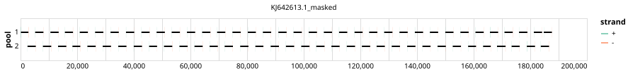

# artic-inrb-mpox 2500bp v1.0.1


## Notes

A rebalanced version of artic-inrb-mpox/2500/v1.0.0

## Metadata

**Target Organisms:**
- Monkeypox virus (Tax ID: 10244)

**Derived from:** artic-inrb-mpox/2500/v1.0.0

## Contributors

- ARTIC network
- INRB
- Quick Lab

## Overviews

<div style="width: 100%;"></div>

## Details

```json
{
    "schema_version": "1.0.0-alpha",
    "primer_scheme_name": "artic-inrb-mpox",
    "amplicon_size": 2500,
    "primer_scheme_version": "v1.0.1",
    "primer_scheme_identifier": "artic-inrb-mpox/2500/v1.0.1",
    "primer_scheme_contributor": [
        {
            "primer_scheme_contributor_name": "ARTIC network"
        },
        {
            "primer_scheme_contributor_name": "INRB"
        },
        {
            "primer_scheme_contributor_name": "Quick Lab"
        }
    ],
    "primer_scheme_target_organism": [
        {
            "primer_scheme_target_organism_name": "Monkeypox virus",
            "primer_scheme_target_organism_ncbi_taxon_id": "10244"
        }
    ],
    "primer_scheme_license": "CC-BY-SA-4.0",
    "primer_scheme_development_status": "VALIDATED",
    "primer_scheme_scope": [
        "WHOLE-GENOME"
    ],
    "primer_scheme_derived_from": "artic-inrb-mpox/2500/v1.0.0",
    "primer_scheme_details": [
        "A rebalanced version of artic-inrb-mpox/2500/v1.0.0"
    ],
    "primer_scheme_generator": {
        "primer_scheme_generator_name": "primalscheme3"
    },
    "primer_scheme_checksums": {
        "primer_scheme_sha256": "cb8c950ae9b6cfd2a062e7c2395f593058f90af1cd09fd4c175f494fee6c0416",
        "reference_sequence_sha256": "8f9ba70e30a0e373f39ffba4cb95ef3da3c3a3b8acc41751cca1ced2ed928ebb"
    },
    "primer_scheme_creation_date": "2025-01-21",
    "primer_scheme_submission_date": "2026-09-01"
}
```


------------------------------------------------------------------------

This work is licensed under a [Creative Commons Attribution-ShareAlike 4.0 International License](http://creativecommons.org/licenses/by-sa/4.0/).

