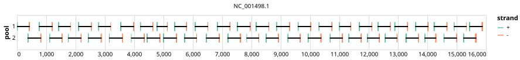

# artic-measles 400bp v1.0.0


> If you use this scheme please cite: https://doi.org/10.1101/2024.12.20.629611

## Notes

A pan Measles morbillivirus scheme. All full length genomes have been downloaded and phylogenetically downsampled to 0.95 RTL.

## Metadata

**Target Organisms:**
- Measles morbillivirus (Tax ID: 11234)

## Contributors

- Chris Kent
- Quick Lab

## Overviews

<div style="width: 100%;"></div>

## Details

```json
{
    "schema_version": "1.0.0-alpha",
    "primer_scheme_name": "artic-measles",
    "amplicon_size": 400,
    "primer_scheme_version": "v1.0.0",
    "primer_scheme_identifier": "artic-measles/400/v1.0.0",
    "primer_scheme_contributor": [
        {
            "primer_scheme_contributor_name": "Chris Kent"
        },
        {
            "primer_scheme_contributor_name": "Quick Lab"
        }
    ],
    "primer_scheme_target_organism": [
        {
            "primer_scheme_target_organism_name": "Measles morbillivirus",
            "primer_scheme_target_organism_ncbi_taxon_id": "11234"
        }
    ],
    "primer_scheme_license": "CC-BY-SA-4.0",
    "primer_scheme_development_status": "VALIDATED",
    "primer_scheme_application": [
        "CLINICAL",
        "WASTEWATER"
    ],
    "primer_scheme_scope": [
        "WHOLE-GENOME"
    ],
    "citation": [
        "https://doi.org/10.1101/2024.12.20.629611"
    ],
    "primer_scheme_details": [
        "A pan Measles morbillivirus scheme. All full length genomes have been downloaded and phylogenetically downsampled to 0.95 RTL."
    ],
    "primer_scheme_generator": {
        "primer_scheme_generator_name": "primalscheme3",
        "primer_scheme_generator_version": "1.1.4"
    },
    "primer_scheme_checksums": {
        "primer_scheme_sha256": "d28b6f9e9b69ea6e40c748b6c81939fc1916cec9d1822378ee186486e0c5f144",
        "reference_sequence_sha256": "85699642c936b33d5506e18a966fb1d0da8318e77b66d6d1d83ea934b5da636e"
    },
    "primer_scheme_creation_date": "2024-02-27",
    "primer_scheme_submission_date": "2026-09-01"
}
```


------------------------------------------------------------------------

This work is licensed under a [Creative Commons Attribution-ShareAlike 4.0 International License](http://creativecommons.org/licenses/by-sa/4.0/).

