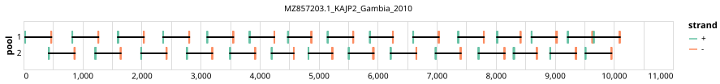

# artic-pan-dengue 400bp v1.0.0


## Notes

A 400bp scheme designed to work for all dengue subtypes

## Metadata

**Target Organisms:**
- Dengue virus (Tax ID: 12637)

## Contributors

- ARTIC network
- DeZi Network

## Overviews

<div style="width: 100%;"></div>

## Details

```json
{
    "schema_version": "1.0.0-alpha",
    "primer_scheme_name": "artic-pan-dengue",
    "amplicon_size": 400,
    "primer_scheme_version": "v1.0.0",
    "primer_scheme_identifier": "artic-pan-dengue/400/v1.0.0",
    "primer_scheme_contributor": [
        {
            "primer_scheme_contributor_name": "ARTIC network"
        },
        {
            "primer_scheme_contributor_name": "DeZi Network"
        }
    ],
    "primer_scheme_target_organism": [
        {
            "primer_scheme_target_organism_name": "Dengue virus",
            "primer_scheme_target_organism_ncbi_taxon_id": "12637"
        }
    ],
    "primer_scheme_license": "CC-BY-SA-4.0",
    "primer_scheme_development_status": "DRAFT",
    "primer_scheme_details": [
        "A 400bp scheme designed to work for all dengue subtypes"
    ],
    "primer_scheme_generator": {
        "primer_scheme_generator_name": "primalscheme3",
        "primer_scheme_generator_version": "3.0.3"
    },
    "primer_scheme_checksums": {
        "primer_scheme_sha256": "c9b85d138a678c9b754fdf0031583ed91a18b972efd8d143bf2efdf06dc314b3",
        "reference_sequence_sha256": "7d3afa501aab4a4caa1e49c3b738bfd3b39fdc189b2768902465332eac311d29"
    },
    "primer_scheme_creation_date": "2025-04-25",
    "primer_scheme_submission_date": "2026-09-01"
}
```


------------------------------------------------------------------------

This work is licensed under a [Creative Commons Attribution-ShareAlike 4.0 International License](http://creativecommons.org/licenses/by-sa/4.0/).

