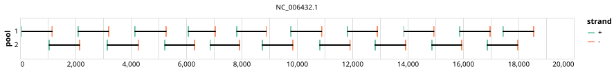

# artic-pan-ebola 1000bp v2.0.0-sudan


## Notes

This is the artic-pan-ebola/1000/v2.0.0 primer scheme remapped to a sudan genome

## Metadata

**Target Organisms:**
- Orthoebolavirus (Tax ID: 3044781)

**Derived from:** artic-pan-ebola/1000/v2.0.0

## Contributors

- ARTIC network
- Quick Lab

## Overviews

<div style="width: 100%;"></div>

## Details

```json
{
    "schema_version": "1.0.0-alpha",
    "primer_scheme_name": "artic-pan-ebola",
    "amplicon_size": 1000,
    "primer_scheme_version": "v2.0.0-sudan",
    "primer_scheme_identifier": "artic-pan-ebola/1000/v2.0.0-sudan",
    "primer_scheme_contributor": [
        {
            "primer_scheme_contributor_name": "ARTIC network"
        },
        {
            "primer_scheme_contributor_name": "Quick Lab"
        }
    ],
    "primer_scheme_target_organism": [
        {
            "primer_scheme_target_organism_name": "Orthoebolavirus",
            "primer_scheme_target_organism_ncbi_taxon_id": "3044781"
        }
    ],
    "primer_scheme_license": "CC-BY-SA-4.0",
    "primer_scheme_development_status": "TESTED",
    "primer_scheme_derived_from": "artic-pan-ebola/1000/v2.0.0",
    "primer_scheme_details": [
        "This is the artic-pan-ebola/1000/v2.0.0 primer scheme remapped to a sudan genome"
    ],
    "primer_scheme_generator": {
        "primer_scheme_generator_name": "primalscheme3",
        "primer_scheme_generator_version": "3.4"
    },
    "primer_scheme_checksums": {
        "primer_scheme_sha256": "ef6e1c2697115318b36437953c49c8cf7a11cac78b45a45dbfbb166231d09c82",
        "reference_sequence_sha256": "06e18979d361528d0814eed3f833e27aaadbf857351828850df5ccd1e01a8df3"
    },
    "primer_scheme_creation_date": "2026-06-10",
    "primer_scheme_submission_date": "2026-09-01"
}
```


------------------------------------------------------------------------

This work is licensed under a [Creative Commons Attribution-ShareAlike 4.0 International License](http://creativecommons.org/licenses/by-sa/4.0/).

