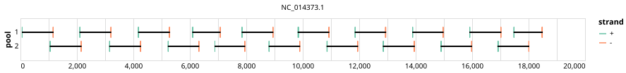

# artic-pan-ebola 1000bp v2.0.0


## Metadata

**Target Organisms:**
- Orthoebolavirus (Tax ID: 3044781)

## Contributors

- ARTIC network
- Quick Lab

## Overviews

<div style="width: 100%;"></div>

## Details

```json
{
    "schema_version": "1.0.0-alpha",
    "primer_scheme_name": "artic-pan-ebola",
    "amplicon_size": 1000,
    "primer_scheme_version": "v2.0.0",
    "primer_scheme_identifier": "artic-pan-ebola/1000/v2.0.0",
    "primer_scheme_contributor": [
        {
            "primer_scheme_contributor_name": "ARTIC network"
        },
        {
            "primer_scheme_contributor_name": "Quick Lab"
        }
    ],
    "primer_scheme_target_organism": [
        {
            "primer_scheme_target_organism_name": "Orthoebolavirus",
            "primer_scheme_target_organism_ncbi_taxon_id": "3044781"
        }
    ],
    "primer_scheme_license": "CC-BY-SA-4.0",
    "primer_scheme_development_status": "TESTED",
    "primer_scheme_generator": {
        "primer_scheme_generator_name": "primalscheme3",
        "primer_scheme_generator_version": "3.4"
    },
    "primer_scheme_checksums": {
        "primer_scheme_sha256": "fc29628fb00b6dc3a3a57c7d2bbb8b0d97d43c7b3692231dc8be432032e1bd39",
        "reference_sequence_sha256": "5dd2fc9208d6946df5c9ca30d16aa8be524d560aa595caff13f803d1c9ce414a"
    },
    "primer_scheme_creation_date": "2026-06-10",
    "primer_scheme_submission_date": "2026-09-01"
}
```


------------------------------------------------------------------------

This work is licensed under a [Creative Commons Attribution-ShareAlike 4.0 International License](http://creativecommons.org/licenses/by-sa/4.0/).

