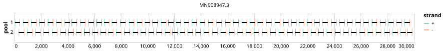

# artic-sars-cov-2 400bp v3.0.0


> If you use this scheme please cite: https://doi.org/10.1038/nprot.2017.066

> If you use this scheme please cite: https://doi.org/10.1101%2F2020.09.04.283077

## Notes

Schemes generated for the SARs-CoV-2 Outbreak

## Metadata

**Target Organisms:**
- Severe acute respiratory syndrome coronavirus 2 (Tax ID: 2697049)

## Contributors

- ARTIC network
- Quick Lab

## Vendors

- IDT: 10011442
- Eurofins ([Website](https://eurofinsgenomics.com))

## Overviews

<div style="width: 100%;"></div>

## Details

```json
{
    "schema_version": "1.0.0-alpha",
    "primer_scheme_name": "artic-sars-cov-2",
    "amplicon_size": 400,
    "primer_scheme_version": "v3.0.0",
    "primer_scheme_identifier": "artic-sars-cov-2/400/v3.0.0",
    "primer_scheme_contributor": [
        {
            "primer_scheme_contributor_name": "ARTIC network"
        },
        {
            "primer_scheme_contributor_name": "Quick Lab"
        }
    ],
    "primer_scheme_target_organism": [
        {
            "primer_scheme_target_organism_name": "Severe acute respiratory syndrome coronavirus 2",
            "primer_scheme_target_organism_ncbi_taxon_id": "2697049"
        }
    ],
    "primer_scheme_identifier_alias": [
        "ARTIC/V3"
    ],
    "primer_scheme_license": "CC-BY-4.0",
    "primer_scheme_development_status": "DEPRECATED",
    "primer_scheme_application": [
        "CLINICAL",
        "WASTEWATER"
    ],
    "primer_scheme_scope": [
        "WHOLE-GENOME"
    ],
    "citation": [
        "https://doi.org/10.1038/nprot.2017.066",
        "https://doi.org/10.1101%2F2020.09.04.283077"
    ],
    "primer_scheme_details": [
        "Schemes generated for the SARs-CoV-2 Outbreak"
    ],
    "primer_scheme_vendor": [
        {
            "primer_scheme_vendor_name": "IDT",
            "primer_scheme_vendor_kit_name": "10011442"
        },
        {
            "primer_scheme_vendor_name": "Eurofins",
            "primer_scheme_vendor_url": "https://eurofinsgenomics.com"
        }
    ],
    "primer_scheme_generator": {
        "primer_scheme_generator_name": "primalscheme1",
        "primer_scheme_generator_version": "1.0.0"
    },
    "primer_scheme_checksums": {
        "primer_scheme_sha256": "99072afd2bdadda154f88b1fd2284525175648371fa1098c82ef67ff9b928f13",
        "reference_sequence_sha256": "9e08a5c6ccabc87074b46989335c3bacdb9662cd5aa3058451255ded8e436226"
    },
    "primer_scheme_creation_date": "2023-11-13",
    "primer_scheme_submission_date": "2026-09-01"
}
```


------------------------------------------------------------------------

This work is licensed under a [Creative Commons Attribution 4.0 International License](http://creativecommons.org/licenses/by/4.0/).

