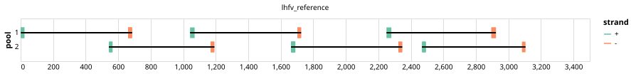

# artic-training-lhf 600bp v1.0.0


## Notes

A PrimerScheme for a synthetic target (lhf) to be used in ARTIC network Training workshops.

## Metadata

**Target Organisms:**
-  (Tax ID: 1515699)

## Contributors

- ARTIC network

## Overviews

<div style="width: 100%;"></div>

## Details

```json
{
    "schema_version": "1.0.0-alpha",
    "primer_scheme_name": "artic-training-lhf",
    "amplicon_size": 600,
    "primer_scheme_version": "v1.0.0",
    "primer_scheme_identifier": "artic-training-lhf/600/v1.0.0",
    "primer_scheme_contributor": [
        {
            "primer_scheme_contributor_name": "ARTIC network"
        }
    ],
    "primer_scheme_target_organism": [
        {
            "primer_scheme_target_organism_ncbi_taxon_id": "1515699"
        }
    ],
    "primer_scheme_license": "CC-BY-SA-4.0",
    "primer_scheme_development_status": "VALIDATED",
    "primer_scheme_details": [
        "A PrimerScheme for a synthetic target (lhf) to be used in ARTIC network Training workshops."
    ],
    "primer_scheme_generator": {
        "primer_scheme_generator_name": "primalscheme"
    },
    "primer_scheme_checksums": {
        "primer_scheme_sha256": "2e24439e7cea0ac1d206e02ea3eb714e5b05146c0c9beb1ed706ecbdaa76d220",
        "reference_sequence_sha256": "ffe0af0b3354982c082a0f62d438ca4f79b9d5f20a49be9fe5d2f39c895b4570"
    },
    "primer_scheme_creation_date": "2026-02-24",
    "primer_scheme_submission_date": "2026-09-01"
}
```


------------------------------------------------------------------------

This work is licensed under a [Creative Commons Attribution-ShareAlike 4.0 International License](http://creativecommons.org/licenses/by-sa/4.0/).

