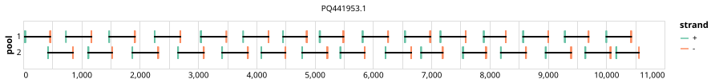

# artic-yfv-west-east-africa 400bp v1.0.0


## Notes

PrimerScheme for yellow fever virus (yfv). Targeted to both east and west african strains.

## Metadata

**Target Organisms:**
- Yellow fever virus (Tax ID: 11089)

## Contributors

- Quick Lab
- ARTIC network

## Overviews

<div style="width: 100%;"></div>

## Details

```json
{
    "schema_version": "1.0.0-alpha",
    "primer_scheme_name": "artic-yfv-west-east-africa",
    "amplicon_size": 400,
    "primer_scheme_version": "v1.0.0",
    "primer_scheme_identifier": "artic-yfv-west-east-africa/400/v1.0.0",
    "primer_scheme_contributor": [
        {
            "primer_scheme_contributor_name": "Quick Lab"
        },
        {
            "primer_scheme_contributor_name": "ARTIC network"
        }
    ],
    "primer_scheme_target_organism": [
        {
            "primer_scheme_target_organism_name": "Yellow fever virus",
            "primer_scheme_target_organism_ncbi_taxon_id": "11089"
        }
    ],
    "primer_scheme_identifier_alias": [
        "artic-yellow-fever"
    ],
    "primer_scheme_license": "CC-BY-SA-4.0",
    "primer_scheme_development_status": "DRAFT",
    "primer_scheme_scope": [
        "WHOLE-GENOME"
    ],
    "primer_scheme_details": [
        "PrimerScheme for yellow fever virus (yfv). Targeted to both east and west african strains."
    ],
    "primer_scheme_generator": {
        "primer_scheme_generator_name": "primalscheme3",
        "primer_scheme_generator_version": "3.0.3"
    },
    "primer_scheme_checksums": {
        "primer_scheme_sha256": "f6c90b13eac6d760f2b9a9fed78614a85d9f94c1e79cfe3f2f102543b13f5a72",
        "reference_sequence_sha256": "40d77559ea539ac841aa0f39e02a84234aa54529b29631c0be8ca9ab740f9bec"
    },
    "primer_scheme_creation_date": "2025-04-25",
    "primer_scheme_submission_date": "2026-09-01"
}
```


------------------------------------------------------------------------

This work is licensed under a [Creative Commons Attribution-ShareAlike 4.0 International License](http://creativecommons.org/licenses/by-sa/4.0/).

