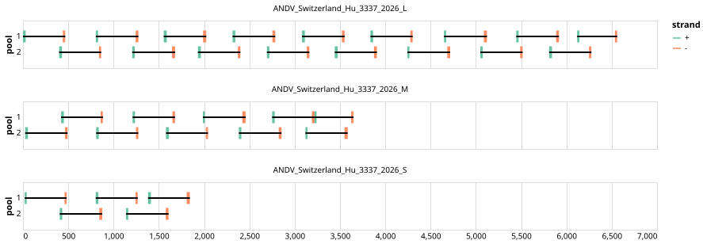

# bccdc-andv-2026 400bp v1.0.0


## Metadata

**Target Organisms:**
- Orthohantavirus andesense (Tax ID: 1980456)

## Contributors

- BCCDC-PHL

## Overviews

<div style="width: 100%;"></div>

## Details

```json
{
    "schema_version": "1.0.0-alpha",
    "primer_scheme_name": "bccdc-andv-2026",
    "amplicon_size": 400,
    "primer_scheme_version": "v1.0.0",
    "primer_scheme_identifier": "bccdc-andv-2026/400/v1.0.0",
    "primer_scheme_contributor": [
        {
            "primer_scheme_contributor_name": "BCCDC-PHL"
        }
    ],
    "primer_scheme_target_organism": [
        {
            "primer_scheme_target_organism_name": "Orthohantavirus andesense",
            "primer_scheme_target_organism_ncbi_taxon_id": "1980456"
        }
    ],
    "primer_scheme_license": "CC-BY-SA-4.0",
    "primer_scheme_development_status": "TESTED",
    "primer_scheme_generator": {
        "primer_scheme_generator_name": "primalscheme3",
        "primer_scheme_generator_version": "3.3"
    },
    "primer_scheme_checksums": {
        "primer_scheme_sha256": "febde72d2dc7d9710b9fa467381cc9e0a851dc2582f4f8e6a9e60f09c89db570",
        "reference_sequence_sha256": "49ea28f584a48a91dc8d76d58df9483983fa4257c369baf07590d8b890d3e3c2"
    },
    "primer_scheme_creation_date": "2026-05-29",
    "primer_scheme_submission_date": "2026-09-01"
}
```


------------------------------------------------------------------------

This work is licensed under a [Creative Commons Attribution-ShareAlike 4.0 International License](http://creativecommons.org/licenses/by-sa/4.0/).

