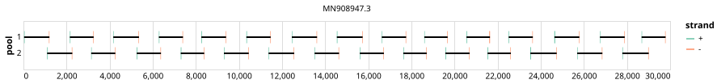

# bccdc-midnight-sars-cov-2 1200bp v1.0.0


> If you use this scheme please cite: https://dx.doi.org/10.17504/protocols.io.bwyppfvn

## Notes

Accomodates P.1

## Metadata

**Target Organisms:**
- Severe acute respiratory syndrome coronavirus 2 (Tax ID: 2697049)

**Derived from:** midnight-sars-cov-2/1200/v1.0.0

## Contributors

- Nikki Freed
- Olin Silander
- BCCDC-PHL

## Overviews

<div style="width: 100%;"></div>

## Details

```json
{
    "schema_version": "1.0.0-alpha",
    "primer_scheme_name": "bccdc-midnight-sars-cov-2",
    "amplicon_size": 1200,
    "primer_scheme_version": "v1.0.0",
    "primer_scheme_identifier": "bccdc-midnight-sars-cov-2/1200/v1.0.0",
    "primer_scheme_contributor": [
        {
            "primer_scheme_contributor_name": "Nikki Freed"
        },
        {
            "primer_scheme_contributor_name": "Olin Silander"
        },
        {
            "primer_scheme_contributor_name": "BCCDC-PHL"
        }
    ],
    "primer_scheme_target_organism": [
        {
            "primer_scheme_target_organism_name": "Severe acute respiratory syndrome coronavirus 2",
            "primer_scheme_target_organism_ncbi_taxon_id": "2697049"
        }
    ],
    "primer_scheme_license": "CC-BY-SA-4.0",
    "primer_scheme_development_status": "DEPRECATED",
    "primer_scheme_derived_from": "midnight-sars-cov-2/1200/v1.0.0",
    "citation": [
        "https://dx.doi.org/10.17504/protocols.io.bwyppfvn"
    ],
    "primer_scheme_details": [
        "Accomodates P.1"
    ],
    "primer_scheme_checksums": {
        "primer_scheme_sha256": "ff7fd0957777aa991e5ba4273e0c3cdea8dd091b0cb1078dc0fd23aca5a90634",
        "reference_sequence_sha256": "4e43298c083d3da7bfbab890e351e3e58015f9bd7fac1bdee097d11ac89f785d"
    }
}
```


------------------------------------------------------------------------

This work is licensed under a [Creative Commons Attribution-ShareAlike 4.0 International License](http://creativecommons.org/licenses/by-sa/4.0/).

