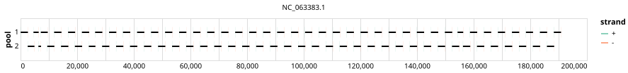

# bccdc-mpox 2500bp v2.3.0


> If you use this scheme please cite: https://dx.doi.org/10.17504/protocols.io.n2bvj34nnlk5/v1

## Notes

PrimerScheme for the global 2022 West African clade outbreak

Homepage: https://github.com/BCCDC-PHL/artic-mpxv2022/tree/main/primer_schemes/mpxv-2022/V2.3

## Metadata

**Target Organisms:**
- Monkeypox virus (Tax ID: 10244)

## Contributors

- BCCDC-PHL

## Overviews

<div style="width: 100%;"></div>

## Details

```json
{
    "schema_version": "1.0.0-alpha",
    "primer_scheme_name": "bccdc-mpox",
    "amplicon_size": 2500,
    "primer_scheme_version": "v2.3.0",
    "primer_scheme_identifier": "bccdc-mpox/2500/v2.3.0",
    "primer_scheme_contributor": [
        {
            "primer_scheme_contributor_name": "BCCDC-PHL"
        }
    ],
    "primer_scheme_target_organism": [
        {
            "primer_scheme_target_organism_name": "Monkeypox virus",
            "primer_scheme_target_organism_ncbi_taxon_id": "10244"
        }
    ],
    "primer_scheme_license": "CC-BY-SA-4.0",
    "primer_scheme_development_status": "VALIDATED",
    "primer_scheme_scope": [
        "WHOLE-GENOME"
    ],
    "citation": [
        "https://dx.doi.org/10.17504/protocols.io.n2bvj34nnlk5/v1"
    ],
    "primer_scheme_details": [
        "PrimerScheme for the global 2022 West African clade outbreak",
        "Homepage: https://github.com/BCCDC-PHL/artic-mpxv2022/tree/main/primer_schemes/mpxv-2022/V2.3"
    ],
    "primer_scheme_generator": {
        "primer_scheme_generator_name": "primalscheme2"
    },
    "primer_scheme_checksums": {
        "primer_scheme_sha256": "c233a141dc309165117c377eb6126e0f83c4f2ec9bf1394ae7acba0d5066fec7",
        "reference_sequence_sha256": "d42cce2bce1c3e7c6f66c12c10221f6e5e633cf291923f0ae44a27c753c1ad8d"
    },
    "primer_scheme_creation_date": "2024-09-06",
    "primer_scheme_submission_date": "2026-09-01"
}
```


------------------------------------------------------------------------

This work is licensed under a [Creative Commons Attribution-ShareAlike 4.0 International License](http://creativecommons.org/licenses/by-sa/4.0/).

