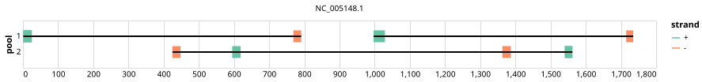

# bioassets-cgm-pcv2 700bp v1.0.0


## Metadata

**Target Organisms:**
- Porcine circovirus 2 (Tax ID: 85708)

## Contributors

- bioassets-corporation

## Overviews

<div style="width: 100%;"></div>

## Details

```json
{
    "schema_version": "1.0.0-alpha",
    "primer_scheme_name": "bioassets-cgm-pcv2",
    "amplicon_size": 700,
    "primer_scheme_version": "v1.0.0",
    "primer_scheme_identifier": "bioassets-cgm-pcv2/700/v1.0.0",
    "primer_scheme_contributor": [
        {
            "primer_scheme_contributor_name": "bioassets-corporation"
        }
    ],
    "primer_scheme_target_organism": [
        {
            "primer_scheme_target_organism_name": "Porcine circovirus 2",
            "primer_scheme_target_organism_ncbi_taxon_id": "85708"
        }
    ],
    "primer_scheme_license": "CC-BY-SA-4.0",
    "primer_scheme_development_status": "DRAFT",
    "primer_scheme_generator": {
        "primer_scheme_generator_name": "primalscheme3",
        "primer_scheme_generator_version": "3.3.0"
    },
    "primer_scheme_checksums": {
        "primer_scheme_sha256": "442559076e6ba3c76013eea1b5dc7d4d0bed52bb1df8ad5edd67d5284ca6a986",
        "reference_sequence_sha256": "53f82dd089f2596bf0a9029bdf77214c275e808a654c9b7e2dce147078ead01b"
    },
    "primer_scheme_creation_date": "2026-04-01",
    "primer_scheme_submission_date": "2026-09-01"
}
```


------------------------------------------------------------------------

This work is licensed under a [Creative Commons Attribution-ShareAlike 4.0 International License](http://creativecommons.org/licenses/by-sa/4.0/).

