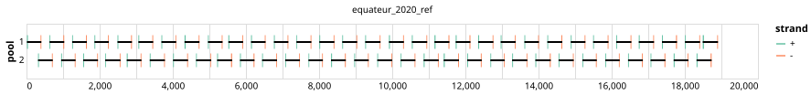

# ebola-equateur-2020 400bp v1.0.0


## Metadata

**Target Organisms:**
- Ebola virus (Tax ID: 1570291)

## Contributors

- ARTIC network
- INRB

## Overviews

<div style="width: 100%;"></div>

## Details

```json
{
    "schema_version": "1.0.0-alpha",
    "primer_scheme_name": "ebola-equateur-2020",
    "amplicon_size": 400,
    "primer_scheme_version": "v1.0.0",
    "primer_scheme_identifier": "ebola-equateur-2020/400/v1.0.0",
    "primer_scheme_contributor": [
        {
            "primer_scheme_contributor_name": "ARTIC network"
        },
        {
            "primer_scheme_contributor_name": "INRB"
        }
    ],
    "primer_scheme_target_organism": [
        {
            "primer_scheme_target_organism_name": "Ebola virus",
            "primer_scheme_target_organism_ncbi_taxon_id": "1570291"
        }
    ],
    "primer_scheme_license": "CC-BY-SA-4.0",
    "primer_scheme_development_status": "TESTED",
    "primer_scheme_scope": [
        "WHOLE-GENOME"
    ],
    "primer_scheme_generator": {
        "primer_scheme_generator_name": "primalscheme1"
    },
    "primer_scheme_checksums": {
        "primer_scheme_sha256": "9f813a29faf2d1e1c5ba50f67771e2a51c530d0b03e8e5efe724be5f8ae8f629",
        "reference_sequence_sha256": "5704aef619f037c4d378296bce915bdab673138157bf2ae88f5166182d919aae"
    },
    "primer_scheme_creation_date": "2025-09-04",
    "primer_scheme_submission_date": "2026-09-01"
}
```


------------------------------------------------------------------------

This work is licensed under a [Creative Commons Attribution-ShareAlike 4.0 International License](http://creativecommons.org/licenses/by-sa/4.0/).

