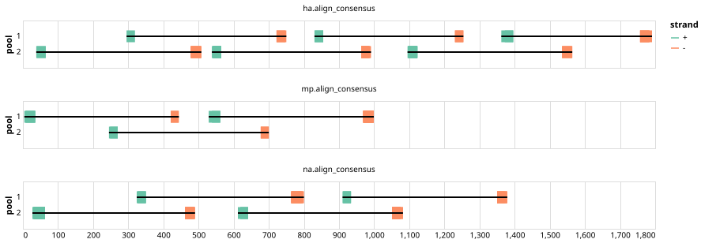

# ethz-eawag-h1n1-h3n2 400bp v1.0.0


## Notes

Primer panel for wastewater-based genomic surveillance of influenza A virus that targets segments of the surface proteins HA, NA, and M of common influenza subtypes H1N1 and H3N2

## Metadata

**Target Organisms:**
- Influenza A virus H3N2 (Tax ID: 41857)
- H1N1 swine influenza virus (Tax ID: 36420)

## Contributors

- Anika John
- Seju Kang
- Lara Fuhrmann
- Ivan Topolsky
- Chris Kent
- Josh Quick
- Timothy R. Julian
- Niko Beerenwinkel

## Overviews

<div style="width: 100%;"></div>

## Details

```json
{
    "schema_version": "1.0.0-alpha",
    "primer_scheme_name": "ethz-eawag-h1n1-h3n2",
    "amplicon_size": 400,
    "primer_scheme_version": "v1.0.0",
    "primer_scheme_identifier": "ethz-eawag-h1n1-h3n2/400/v1.0.0",
    "primer_scheme_contributor": [
        {
            "primer_scheme_contributor_name": "Anika John"
        },
        {
            "primer_scheme_contributor_name": "Seju Kang"
        },
        {
            "primer_scheme_contributor_name": "Lara Fuhrmann"
        },
        {
            "primer_scheme_contributor_name": "Ivan Topolsky"
        },
        {
            "primer_scheme_contributor_name": "Chris Kent"
        },
        {
            "primer_scheme_contributor_name": "Josh Quick"
        },
        {
            "primer_scheme_contributor_name": "Timothy R. Julian"
        },
        {
            "primer_scheme_contributor_name": "Niko Beerenwinkel"
        }
    ],
    "primer_scheme_target_organism": [
        {
            "primer_scheme_target_organism_name": "Influenza A virus H3N2",
            "primer_scheme_target_organism_ncbi_taxon_id": "41857"
        },
        {
            "primer_scheme_target_organism_name": "H1N1 swine influenza virus",
            "primer_scheme_target_organism_ncbi_taxon_id": "36420"
        }
    ],
    "primer_scheme_license": "CC-BY-SA-4.0",
    "primer_scheme_development_status": "VALIDATED",
    "primer_scheme_application": [
        "WASTEWATER"
    ],
    "primer_scheme_details": [
        "Primer panel for wastewater-based genomic surveillance of influenza A virus that targets segments of the surface proteins HA, NA, and M of common influenza subtypes H1N1 and H3N2"
    ],
    "primer_scheme_generator": {
        "primer_scheme_generator_name": "primalscheme3",
        "primer_scheme_generator_version": "1.1.4"
    },
    "primer_scheme_checksums": {
        "primer_scheme_sha256": "2e77111962cceb39b692f058949dc160bf99cc79aac268e4ba6ecdc93d0e1b3d",
        "reference_sequence_sha256": "a59458f3bfaf351e503b58098a9e09114e96dc740441860c215d41c9ccd952bf"
    },
    "primer_scheme_creation_date": "2025-04-14",
    "primer_scheme_submission_date": "2026-09-01"
}
```


------------------------------------------------------------------------

This work is licensed under a [Creative Commons Attribution-ShareAlike 4.0 International License](http://creativecommons.org/licenses/by-sa/4.0/).

