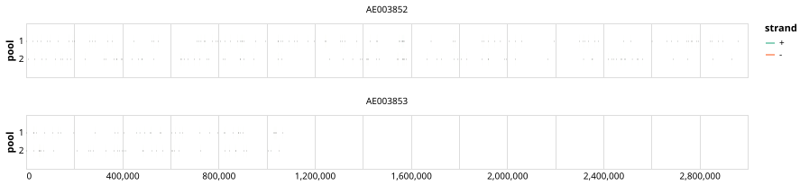

# gates-vibrio-cholerae 400bp v1.0.0


## Metadata

**Target Organisms:**
- Vibrio cholerae (Tax ID: 666)

## Contributors

- Alvaro Garcia-Delgado
- Quick Lab

## Overviews

<div style="width: 100%;"></div>

## Details

```json
{
    "schema_version": "1.0.0-alpha",
    "primer_scheme_name": "gates-vibrio-cholerae",
    "amplicon_size": 400,
    "primer_scheme_version": "v1.0.0",
    "primer_scheme_identifier": "gates-vibrio-cholerae/400/v1.0.0",
    "primer_scheme_contributor": [
        {
            "primer_scheme_contributor_name": "Alvaro Garcia-Delgado"
        },
        {
            "primer_scheme_contributor_name": "Quick Lab"
        }
    ],
    "primer_scheme_target_organism": [
        {
            "primer_scheme_target_organism_name": "Vibrio cholerae",
            "primer_scheme_target_organism_ncbi_taxon_id": "666"
        }
    ],
    "primer_scheme_license": "CC-BY-SA-4.0",
    "primer_scheme_development_status": "DRAFT",
    "primer_scheme_generator": {
        "primer_scheme_generator_name": "primalscheme3"
    },
    "primer_scheme_checksums": {
        "primer_scheme_sha256": "cf2233e858d3bb6361033b021717ab8c090e10be0fef72f7f12ecbc490ecf73c",
        "reference_sequence_sha256": "c22b58f12ccdcda30669be4b089e8d578c33bc5d6ffc2b8309ede342371448e2"
    },
    "primer_scheme_creation_date": "2026-03-31",
    "primer_scheme_submission_date": "2026-09-01"
}
```


------------------------------------------------------------------------

This work is licensed under a [Creative Commons Attribution-ShareAlike 4.0 International License](http://creativecommons.org/licenses/by-sa/4.0/).

