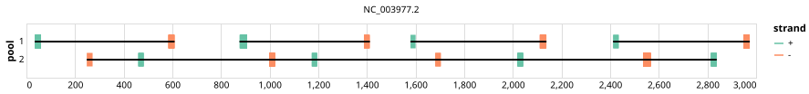

# hbv 500bp v1.1.0


## Notes

Schemes generated for the Hepatitis B virus (hbv)

## Metadata

**Target Organisms:**
- Hepatitis B virus (Tax ID: 10407)

## Contributors

- Quick Lab
- ARTIC network

## Overviews

<div style="width: 100%;"></div>

## Details

```json
{
    "schema_version": "1.0.0-alpha",
    "primer_scheme_name": "hbv",
    "amplicon_size": 500,
    "primer_scheme_version": "v1.1.0",
    "primer_scheme_identifier": "hbv/500/v1.1.0",
    "primer_scheme_contributor": [
        {
            "primer_scheme_contributor_name": "Quick Lab"
        },
        {
            "primer_scheme_contributor_name": "ARTIC network"
        }
    ],
    "primer_scheme_target_organism": [
        {
            "primer_scheme_target_organism_name": "Hepatitis B virus",
            "primer_scheme_target_organism_ncbi_taxon_id": "10407"
        }
    ],
    "primer_scheme_identifier_alias": [
        "hepatitis-b-virus"
    ],
    "primer_scheme_license": "CC-BY-4.0",
    "primer_scheme_development_status": "DEPRECATED",
    "primer_scheme_application": [
        "CLINICAL"
    ],
    "primer_scheme_scope": [
        "WHOLE-GENOME"
    ],
    "primer_scheme_details": [
        "Schemes generated for the Hepatitis B virus (hbv)"
    ],
    "primer_scheme_generator": {
        "primer_scheme_generator_name": "primaldigest",
        "primer_scheme_generator_version": "1.1.3"
    },
    "primer_scheme_checksums": {
        "primer_scheme_sha256": "6f55c1a570d7ec9e636e38bbb29dfb674f1c1d31bf11536b670affcf7ff8cb47",
        "reference_sequence_sha256": "348d1a2160b33fa3669bad339afd139a24a1f685ebf0dc6dfe3e6297e10d68f1"
    },
    "primer_scheme_creation_date": "2023-10-25",
    "primer_scheme_submission_date": "2026-09-01"
}
```


------------------------------------------------------------------------

This work is licensed under a [Creative Commons Attribution 4.0 International License](http://creativecommons.org/licenses/by/4.0/).

