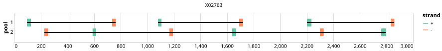

# hbv 600bp v2.1.0


> If you use this scheme please cite: https://dx.doi.org/10.17504/protocols.io.5jyl82bedl2w/v1

## Notes

Contains additional Spike in primers for clades G and H

## Metadata

**Target Organisms:**
- Hepatitis B virus (Tax ID: 10407)

**Derived from:** hbv/600/v2.0.0

## Contributors

- Sheila Lumley
- Chris Kent
- Quick Lab

## Overviews

<div style="width: 100%;"></div>

## Details

```json
{
    "schema_version": "1.0.0-alpha",
    "primer_scheme_name": "hbv",
    "amplicon_size": 600,
    "primer_scheme_version": "v2.1.0",
    "primer_scheme_identifier": "hbv/600/v2.1.0",
    "primer_scheme_contributor": [
        {
            "primer_scheme_contributor_name": "Sheila Lumley"
        },
        {
            "primer_scheme_contributor_name": "Chris Kent"
        },
        {
            "primer_scheme_contributor_name": "Quick Lab"
        }
    ],
    "primer_scheme_target_organism": [
        {
            "primer_scheme_target_organism_name": "Hepatitis B virus",
            "primer_scheme_target_organism_ncbi_taxon_id": "10407"
        }
    ],
    "primer_scheme_identifier_alias": [
        "hepatitis-b-virus"
    ],
    "primer_scheme_license": "CC-BY-SA-4.0",
    "primer_scheme_development_status": "VALIDATED",
    "primer_scheme_application": [
        "CLINICAL"
    ],
    "primer_scheme_scope": [
        "WHOLE-GENOME"
    ],
    "primer_scheme_derived_from": "hbv/600/v2.0.0",
    "citation": [
        "https://dx.doi.org/10.17504/protocols.io.5jyl82bedl2w/v1"
    ],
    "primer_scheme_details": [
        "Contains additional Spike in primers for clades G and H"
    ],
    "primer_scheme_generator": {
        "primer_scheme_generator_name": "primalscheme3",
        "primer_scheme_generator_version": "1.1.4"
    },
    "primer_scheme_checksums": {
        "primer_scheme_sha256": "061e14276540fdf15fcf8ce8de376f12c66a886f61e1509e9d326dfe252c537e",
        "reference_sequence_sha256": "772fadf4a4064d2576c459102de296c193944742e9822eb315606875492d0b36"
    },
    "primer_scheme_creation_date": "2024-03-14",
    "primer_scheme_submission_date": "2026-09-01"
}
```


------------------------------------------------------------------------

This work is licensed under a [Creative Commons Attribution-ShareAlike 4.0 International License](http://creativecommons.org/licenses/by-sa/4.0/).

