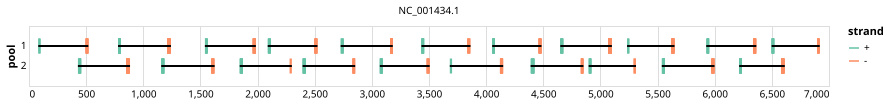

# hev 400bp v1.0.0


## Notes

A full genome scheme designed for the Hepatitis E virus. Utilising phylogenic downsampling to reduce representation bias

## Metadata

**Target Organisms:**
- Hepatitis E virus (Tax ID: 291484)

## Contributors

- ARTIC network
- Quick Lab

## Overviews

<div style="width: 100%;"></div>

## Details

```json
{
    "schema_version": "1.0.0-alpha",
    "primer_scheme_name": "hev",
    "amplicon_size": 400,
    "primer_scheme_version": "v1.0.0",
    "primer_scheme_identifier": "hev/400/v1.0.0",
    "primer_scheme_contributor": [
        {
            "primer_scheme_contributor_name": "ARTIC network"
        },
        {
            "primer_scheme_contributor_name": "Quick Lab"
        }
    ],
    "primer_scheme_target_organism": [
        {
            "primer_scheme_target_organism_name": "Hepatitis E virus",
            "primer_scheme_target_organism_ncbi_taxon_id": "291484"
        }
    ],
    "primer_scheme_identifier_alias": [
        "hepatitis-e-virus"
    ],
    "primer_scheme_license": "CC-BY-SA-4.0",
    "primer_scheme_development_status": "DRAFT",
    "primer_scheme_application": [
        "WASTEWATER"
    ],
    "primer_scheme_scope": [
        "WHOLE-GENOME"
    ],
    "primer_scheme_details": [
        "A full genome scheme designed for the Hepatitis E virus. Utilising phylogenic downsampling to reduce representation bias"
    ],
    "primer_scheme_generator": {
        "primer_scheme_generator_name": "primalscheme3",
        "primer_scheme_generator_version": "1.1.4"
    },
    "primer_scheme_checksums": {
        "primer_scheme_sha256": "cdec551d3a38175864dc5d97741448bfe2d94bc87ca9f1e680bd5d26ad87f07b",
        "reference_sequence_sha256": "be92fea5675b9c07ac568d305c2131203f38c8dfd5e3f6cf2263013c6cb5693c"
    },
    "primer_scheme_creation_date": "2024-03-05",
    "primer_scheme_submission_date": "2026-09-01"
}
```


------------------------------------------------------------------------

This work is licensed under a [Creative Commons Attribution-ShareAlike 4.0 International License](http://creativecommons.org/licenses/by-sa/4.0/).

