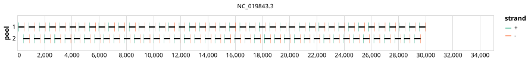

# mers-cov 400bp v1.0.0


## Metadata

**Target Organisms:**
- Middle East respiratory syndrome-related coronavirus (Tax ID: 1335626)

## Contributors

- Quick Lab
- ARTIC network

## Overviews

<div style="width: 100%;"></div>

## Details

```json
{
    "schema_version": "1.0.0-alpha",
    "primer_scheme_name": "mers-cov",
    "amplicon_size": 400,
    "primer_scheme_version": "v1.0.0",
    "primer_scheme_identifier": "mers-cov/400/v1.0.0",
    "primer_scheme_contributor": [
        {
            "primer_scheme_contributor_name": "Quick Lab"
        },
        {
            "primer_scheme_contributor_name": "ARTIC network"
        }
    ],
    "primer_scheme_target_organism": [
        {
            "primer_scheme_target_organism_name": "Middle East respiratory syndrome-related coronavirus",
            "primer_scheme_target_organism_ncbi_taxon_id": "1335626"
        }
    ],
    "primer_scheme_license": "CC-BY-SA-4.0",
    "primer_scheme_development_status": "DRAFT",
    "primer_scheme_scope": [
        "WHOLE-GENOME"
    ],
    "primer_scheme_generator": {
        "primer_scheme_generator_name": "primaldigest",
        "primer_scheme_generator_version": "1.2.2"
    },
    "primer_scheme_checksums": {
        "primer_scheme_sha256": "1efd65cb52bd9fa651971453145ceee746833327594491bd7e2dd56da9aeac06",
        "reference_sequence_sha256": "db835204e4917b0c532dca8602522b9cc455b35dcfb7abae8aff021596bcc5be"
    },
    "primer_scheme_creation_date": "2023-11-09",
    "primer_scheme_submission_date": "2026-09-01"
}
```


------------------------------------------------------------------------

This work is licensed under a [Creative Commons Attribution-ShareAlike 4.0 International License](http://creativecommons.org/licenses/by-sa/4.0/).

