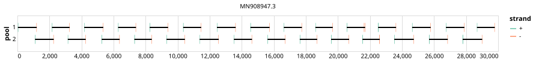

# midnight-sars-cov-2 1200bp v4.0.0-bccdc


> If you use this scheme please cite: https://dx.doi.org/10.17504/protocols.io.bwyppfvn

## Notes

Accomodates Omicron BA.2

IDT calls this the "-Midnight-1200 Amplicon Panel" and "Midnight Amplicon Panel v2"

## Metadata

**Target Organisms:**
- sars-cov-2

**Derived from:** midnight-sars-cov-2/1200/v3.0.0-bccdc

## Contributors

- Nikki Freed
- Olin Silander
- John Tyson
- Tracy Lee

## Overviews

<div style="width: 100%;"></div>

## Details

```json
{
    "schema_version": "1.0.0-alpha",
    "primer_scheme_name": "midnight-sars-cov-2",
    "amplicon_size": 1200,
    "primer_scheme_version": "v4.0.0-bccdc",
    "primer_scheme_identifier": "midnight-sars-cov-2/1200/v4.0.0-bccdc",
    "primer_scheme_contributor": [
        {
            "primer_scheme_contributor_name": "Nikki Freed"
        },
        {
            "primer_scheme_contributor_name": "Olin Silander"
        },
        {
            "primer_scheme_contributor_name": "John Tyson"
        },
        {
            "primer_scheme_contributor_name": "Tracy Lee"
        }
    ],
    "primer_scheme_target_organism": [
        {
            "primer_scheme_target_organism_name": "sars-cov-2"
        }
    ],
    "primer_scheme_identifier_alias": [
        "midnight-idt-v2"
    ],
    "primer_scheme_license": "CC-BY-SA-4.0",
    "primer_scheme_development_status": "DEPRECATED",
    "primer_scheme_derived_from": "midnight-sars-cov-2/1200/v3.0.0-bccdc",
    "citation": [
        "https://dx.doi.org/10.17504/protocols.io.bwyppfvn"
    ],
    "primer_scheme_details": [
        "Accomodates Omicron BA.2",
        "IDT calls this the \"-Midnight-1200 Amplicon Panel\" and \"Midnight Amplicon Panel v2\""
    ],
    "primer_scheme_checksums": {
        "primer_scheme_sha256": "277fb80daf5d462369069508237a400677079c4c554e23506b5915ace9570aff",
        "reference_sequence_sha256": "4e43298c083d3da7bfbab890e351e3e58015f9bd7fac1bdee097d11ac89f785d"
    }
}
```


------------------------------------------------------------------------

This work is licensed under a [Creative Commons Attribution-ShareAlike 4.0 International License](http://creativecommons.org/licenses/by-sa/4.0/).

