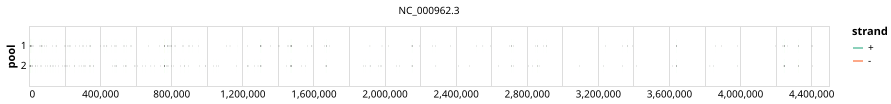

# modjadji-tb-panel 400bp v1.0.0


## Notes

A primer panel for targeting full-length AMR genes and typing snps from mycobacterium tuberculosis

## Metadata

**Target Organisms:**
- Mycobacterium tuberculosis (Tax ID: 1773)

## Contributors

- ARTIC network
- modjadji

## Overviews

<div style="width: 100%;"></div>

## Details

```json
{
    "schema_version": "1.0.0-alpha",
    "primer_scheme_name": "modjadji-tb-panel",
    "amplicon_size": 400,
    "primer_scheme_version": "v1.0.0",
    "primer_scheme_identifier": "modjadji-tb-panel/400/v1.0.0",
    "primer_scheme_contributor": [
        {
            "primer_scheme_contributor_name": "ARTIC network"
        },
        {
            "primer_scheme_contributor_name": "modjadji"
        }
    ],
    "primer_scheme_target_organism": [
        {
            "primer_scheme_target_organism_name": "Mycobacterium tuberculosis",
            "primer_scheme_target_organism_ncbi_taxon_id": "1773"
        }
    ],
    "primer_scheme_license": "CC-BY-SA-4.0",
    "primer_scheme_development_status": "DRAFT",
    "primer_scheme_details": [
        "A primer panel for targeting full-length AMR genes and typing snps from mycobacterium tuberculosis"
    ],
    "primer_scheme_generator": {
        "primer_scheme_generator_name": "primalscheme3"
    },
    "primer_scheme_checksums": {
        "primer_scheme_sha256": "121cbc72485cc36a14e9f6b386a0c1d89e3762aac40dd144b0bc0a2423da4b12",
        "reference_sequence_sha256": "533c67d347eeb2f4ce5ec9c69bad6809f0fe2a01fff30a14365b11d28e0cd7a6"
    },
    "primer_scheme_creation_date": "2025-06-11",
    "primer_scheme_submission_date": "2026-09-01"
}
```


------------------------------------------------------------------------

This work is licensed under a [Creative Commons Attribution-ShareAlike 4.0 International License](http://creativecommons.org/licenses/by-sa/4.0/).

