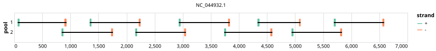

# norovirus-gii 800bp v1.0.0


## Notes

A scheme designed for pan Norovirus gii

## Metadata

**Target Organisms:**
- Norovirus GII (Tax ID: 122929)

## Contributors

- Anna Kovalenko
- Quick Lab
- ARTIC network

## Overviews

<div style="width: 100%;"></div>

## Details

```json
{
    "schema_version": "1.0.0-alpha",
    "primer_scheme_name": "norovirus-gii",
    "amplicon_size": 800,
    "primer_scheme_version": "v1.0.0",
    "primer_scheme_identifier": "norovirus-gii/800/v1.0.0",
    "primer_scheme_contributor": [
        {
            "primer_scheme_contributor_name": "Anna Kovalenko"
        },
        {
            "primer_scheme_contributor_name": "Quick Lab"
        },
        {
            "primer_scheme_contributor_name": "ARTIC network"
        }
    ],
    "primer_scheme_target_organism": [
        {
            "primer_scheme_target_organism_name": "Norovirus GII",
            "primer_scheme_target_organism_ncbi_taxon_id": "122929"
        }
    ],
    "primer_scheme_license": "CC-BY-SA-4.0",
    "primer_scheme_development_status": "TESTED",
    "primer_scheme_scope": [
        "WHOLE-GENOME"
    ],
    "primer_scheme_details": [
        "A scheme designed for pan Norovirus gii"
    ],
    "primer_scheme_generator": {
        "primer_scheme_generator_name": "primaldigest",
        "primer_scheme_generator_version": "1.2.2"
    },
    "primer_scheme_checksums": {
        "primer_scheme_sha256": "acec5b0c4df942d551454af15575ef67ab7985c3568e677c1a1d621f8a06c506",
        "reference_sequence_sha256": "4270296a9de793935f87be19283b1a38c7bd5e04a99fe291f681ef899c35511a"
    },
    "primer_scheme_creation_date": "2023-11-03",
    "primer_scheme_submission_date": "2026-09-01"
}
```


------------------------------------------------------------------------

This work is licensed under a [Creative Commons Attribution-ShareAlike 4.0 International License](http://creativecommons.org/licenses/by-sa/4.0/).

