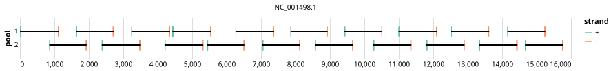

# pan-measles 1000bp v1.0.0


## Metadata

**Target Organisms:**
- Measles morbillivirus (Tax ID: 11234)

## Contributors

- ARTIC network
- Quick Lab

## Overviews

<div style="width: 100%;"></div>

## Details

```json
{
    "schema_version": "1.0.0-alpha",
    "primer_scheme_name": "pan-measles",
    "amplicon_size": 1000,
    "primer_scheme_version": "v1.0.0",
    "primer_scheme_identifier": "pan-measles/1000/v1.0.0",
    "primer_scheme_contributor": [
        {
            "primer_scheme_contributor_name": "ARTIC network"
        },
        {
            "primer_scheme_contributor_name": "Quick Lab"
        }
    ],
    "primer_scheme_target_organism": [
        {
            "primer_scheme_target_organism_name": "Measles morbillivirus",
            "primer_scheme_target_organism_ncbi_taxon_id": "11234"
        }
    ],
    "primer_scheme_license": "CC-BY-SA-4.0",
    "primer_scheme_development_status": "DEPRECATED",
    "primer_scheme_generator": {
        "primer_scheme_generator_name": "primaldigest",
        "primer_scheme_generator_version": "1.2.2"
    },
    "primer_scheme_checksums": {
        "primer_scheme_sha256": "a0af9a51211799e72d68145a0f74b6243dfbb25b67fb47c48b181e55a1821ba5",
        "reference_sequence_sha256": "85699642c936b33d5506e18a966fb1d0da8318e77b66d6d1d83ea934b5da636e"
    },
    "primer_scheme_creation_date": "2023-11-17",
    "primer_scheme_submission_date": "2026-09-01"
}
```


------------------------------------------------------------------------

This work is licensed under a [Creative Commons Attribution-ShareAlike 4.0 International License](http://creativecommons.org/licenses/by-sa/4.0/).

