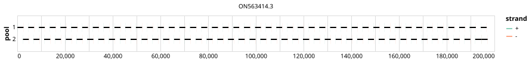

# rigshospitalet 2500bp v1.0.0


> If you use this scheme please cite: https://www.protocols.io/view/monkeypox-virus-whole-genome-sequencing-using-comb-n2bvj6155lk5

## Metadata

**Target Organisms:**
- Monkeypox virus (Tax ID: 10244)

## Contributors

- Martin Schou Pedersen
- Matthijs Welkers
- Marcel Jonges
- Anton van den Ouden

## Overviews

<div style="width: 100%;"></div>

## Details

```json
{
    "schema_version": "1.0.0-alpha",
    "primer_scheme_name": "rigshospitalet",
    "amplicon_size": 2500,
    "primer_scheme_version": "v1.0.0",
    "primer_scheme_identifier": "rigshospitalet/2500/v1.0.0",
    "primer_scheme_contributor": [
        {
            "primer_scheme_contributor_name": "Martin Schou Pedersen"
        },
        {
            "primer_scheme_contributor_name": "Matthijs Welkers"
        },
        {
            "primer_scheme_contributor_name": "Marcel Jonges"
        },
        {
            "primer_scheme_contributor_name": "Anton van den Ouden"
        }
    ],
    "primer_scheme_target_organism": [
        {
            "primer_scheme_target_organism_name": "Monkeypox virus",
            "primer_scheme_target_organism_ncbi_taxon_id": "10244"
        }
    ],
    "primer_scheme_identifier_alias": [
        "erasmus"
    ],
    "primer_scheme_license": "CC-BY-SA-4.0",
    "primer_scheme_development_status": "DRAFT",
    "citation": [
        "https://www.protocols.io/view/monkeypox-virus-whole-genome-sequencing-using-comb-n2bvj6155lk5"
    ],
    "primer_scheme_checksums": {
        "primer_scheme_sha256": "491b706b69f776d4733c2be0f61ccc89e69164d7ccc4a0f0aedd7652d047fe24",
        "reference_sequence_sha256": "2415f80de820bcbffddebbb919e8c23e14496932555f73ca5f0705b752b86966"
    }
}
```


------------------------------------------------------------------------

This work is licensed under a [Creative Commons Attribution-ShareAlike 4.0 International License](http://creativecommons.org/licenses/by-sa/4.0/).

