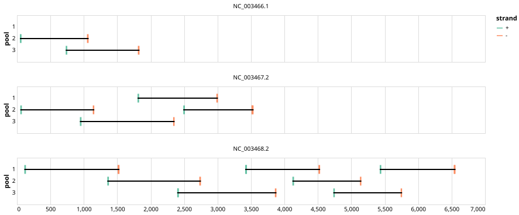

# ukhsa-andes 1000bp v1.1.0


## Notes

An updated version of the scheme with additional primer added in response to genome releases of the recent outbreak of Andes (2026-05-10).

## Metadata

**Target Organisms:**
- Orthohantavirus andesense (Tax ID: 1980456)

## Contributors

- Pathogen Characterisation UKHSA
- Quick Lab

## Overviews

<div style="width: 100%;"></div>

## Details

```json
{
    "schema_version": "1.0.0-alpha",
    "primer_scheme_name": "ukhsa-andes",
    "amplicon_size": 1000,
    "primer_scheme_version": "v1.1.0",
    "primer_scheme_identifier": "ukhsa-andes/1000/v1.1.0",
    "primer_scheme_contributor": [
        {
            "primer_scheme_contributor_name": "Pathogen Characterisation UKHSA"
        },
        {
            "primer_scheme_contributor_name": "Quick Lab"
        }
    ],
    "primer_scheme_target_organism": [
        {
            "primer_scheme_target_organism_name": "Orthohantavirus andesense",
            "primer_scheme_target_organism_ncbi_taxon_id": "1980456"
        }
    ],
    "primer_scheme_license": "CC-BY-SA-4.0",
    "primer_scheme_development_status": "TESTED",
    "primer_scheme_details": [
        "An updated version of the scheme with additional primer added in response to genome releases of the recent outbreak of Andes (2026-05-10)."
    ],
    "primer_scheme_generator": {
        "primer_scheme_generator_name": "varvamp"
    },
    "primer_scheme_checksums": {
        "primer_scheme_sha256": "e66902e5f7f077f596886c337011d268fdb17552140d2bb2c23be4479bfe4613",
        "reference_sequence_sha256": "3396988738bc60e842f98e591a9e07015be8214871283dda99fdec81a31464d7"
    },
    "primer_scheme_creation_date": "2026-05-15",
    "primer_scheme_submission_date": "2026-09-01"
}
```


------------------------------------------------------------------------

This work is licensed under a [Creative Commons Attribution-ShareAlike 4.0 International License](http://creativecommons.org/licenses/by-sa/4.0/).

