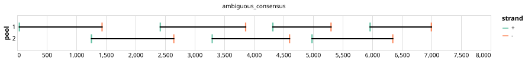

# varvamp-hev3ef 1000bp v1.0.0


> If you use this scheme please cite: https://www.biorxiv.org/content/10.1101/2024.05.08.593102v1.full

## Notes

Pan-specfic primer scheme for HEV genotype 3ef designed with varVAMP on the basis of full length genomes. The design utilizes degenerated primers and was validated on clinical samples and isolates.

Homepage: https://github.com/jonas-fuchs/ViralPrimerSchemes/tree/main/varvamp_tiled/HEV_1

## Metadata

**Target Organisms:**
- Hepatitis E virus (Tax ID: 291484)

## Contributors

- Jonas Fuchs <jonas.fuchs@uniklinik-freiburg.de>

## Overviews

<div style="width: 100%;"></div>

## Details

```json
{
    "schema_version": "1.0.0-alpha",
    "primer_scheme_name": "varvamp-hev3ef",
    "amplicon_size": 1000,
    "primer_scheme_version": "v1.0.0",
    "primer_scheme_identifier": "varvamp-hev3ef/1000/v1.0.0",
    "primer_scheme_contributor": [
        {
            "primer_scheme_contributor_name": "Jonas Fuchs",
            "primer_scheme_contributor_email": "jonas.fuchs@uniklinik-freiburg.de"
        }
    ],
    "primer_scheme_target_organism": [
        {
            "primer_scheme_target_organism_name": "Hepatitis E virus",
            "primer_scheme_target_organism_ncbi_taxon_id": "291484"
        }
    ],
    "primer_scheme_license": "CC-BY-SA-4.0",
    "primer_scheme_development_status": "VALIDATED",
    "primer_scheme_application": [
        "CLINICAL"
    ],
    "primer_scheme_scope": [
        "WHOLE-GENOME"
    ],
    "citation": [
        "https://www.biorxiv.org/content/10.1101/2024.05.08.593102v1.full"
    ],
    "primer_scheme_details": [
        "Pan-specfic primer scheme for HEV genotype 3ef designed with varVAMP on the basis of full length genomes. The design utilizes degenerated primers and was validated on clinical samples and isolates.",
        "Homepage: https://github.com/jonas-fuchs/ViralPrimerSchemes/tree/main/varvamp_tiled/HEV_1"
    ],
    "primer_scheme_generator": {
        "primer_scheme_generator_name": "varvamp",
        "primer_scheme_generator_version": "0.8.2"
    },
    "primer_scheme_checksums": {
        "primer_scheme_sha256": "ba8ca3a9fe9987e01fab003356485ebcabac2256ad15925856330ce4314ff732",
        "reference_sequence_sha256": "e05c24c85c4ddcabe739a1b3eb43825d2757f13fc295b574c83168ad3fecc5d1"
    },
    "primer_scheme_creation_date": "2024-09-13",
    "primer_scheme_submission_date": "2026-09-01"
}
```


------------------------------------------------------------------------

This work is licensed under a [Creative Commons Attribution-ShareAlike 4.0 International License](http://creativecommons.org/licenses/by-sa/4.0/).

