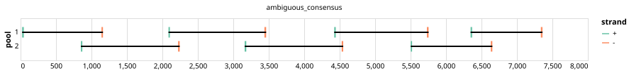

# varvamp-polio 1000bp v1.0.0


> If you use this scheme please cite: https://www.biorxiv.org/content/10.1101/2024.05.08.593102v1.full

## Notes

Pan-specfic primer scheme for poliovirus designed with varVAMP on the basis of full length genomes. The design utilizes degenerated primers and was validated on clinical samples and isolates.

Homepage: https://github.com/jonas-fuchs/ViralPrimerSchemes/tree/main/varvamp_tiled/Polio

## Metadata

**Target Organisms:**
- Poliovirus 1 (Tax ID: 12080)
- Poliovirus 2 (Tax ID: 12083)
- Poliovirus 3 (Tax ID: 12086)

## Contributors

- Jonas Fuchs <jonas.fuchs@uniklinik-freiburg.de>

## Overviews

<div style="width: 100%;"></div>

## Details

```json
{
    "schema_version": "1.0.0-alpha",
    "primer_scheme_name": "varvamp-polio",
    "amplicon_size": 1000,
    "primer_scheme_version": "v1.0.0",
    "primer_scheme_identifier": "varvamp-polio/1000/v1.0.0",
    "primer_scheme_contributor": [
        {
            "primer_scheme_contributor_name": "Jonas Fuchs",
            "primer_scheme_contributor_email": "jonas.fuchs@uniklinik-freiburg.de"
        }
    ],
    "primer_scheme_target_organism": [
        {
            "primer_scheme_target_organism_name": "Poliovirus 1",
            "primer_scheme_target_organism_ncbi_taxon_id": "12080"
        },
        {
            "primer_scheme_target_organism_name": "Poliovirus 2",
            "primer_scheme_target_organism_ncbi_taxon_id": "12083"
        },
        {
            "primer_scheme_target_organism_name": "Poliovirus 3",
            "primer_scheme_target_organism_ncbi_taxon_id": "12086"
        }
    ],
    "primer_scheme_license": "CC-BY-SA-4.0",
    "primer_scheme_development_status": "VALIDATED",
    "primer_scheme_application": [
        "CLINICAL"
    ],
    "primer_scheme_scope": [
        "WHOLE-GENOME"
    ],
    "citation": [
        "https://www.biorxiv.org/content/10.1101/2024.05.08.593102v1.full"
    ],
    "primer_scheme_details": [
        "Pan-specfic primer scheme for poliovirus designed with varVAMP on the basis of full length genomes. The design utilizes degenerated primers and was validated on clinical samples and isolates.",
        "Homepage: https://github.com/jonas-fuchs/ViralPrimerSchemes/tree/main/varvamp_tiled/Polio"
    ],
    "primer_scheme_generator": {
        "primer_scheme_generator_name": "varvamp",
        "primer_scheme_generator_version": "0.8"
    },
    "primer_scheme_checksums": {
        "primer_scheme_sha256": "760f8e5de0d19eefe50809c11b67e934e53660c3baed0422d990f0fd43c4e6bd",
        "reference_sequence_sha256": "2a52f237f388cee4f0b149e84360c897c21091d21c88b3b849c37fb163e550ee"
    },
    "primer_scheme_creation_date": "2024-08-30",
    "primer_scheme_submission_date": "2026-09-01"
}
```


------------------------------------------------------------------------

This work is licensed under a [Creative Commons Attribution-ShareAlike 4.0 International License](http://creativecommons.org/licenses/by-sa/4.0/).

