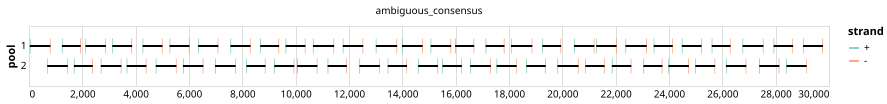

# varvamp-sars-cov-2 700bp v1.0.0


> If you use this scheme please cite: https://www.biorxiv.org/content/10.1101/2024.05.08.593102v1.full

## Notes

Pan-specfic primer scheme for SARS-CoV-2 designed with varVAMP on the basis of full length genomes. The design utilizes degenerated primers and was validated on clinical samples and isolates.

Homepage: https://github.com/jonas-fuchs/ViralPrimerSchemes/tree/main/varvamp_tiled/SARS-CoV-2_2

## Metadata

**Target Organisms:**
- Severe acute respiratory syndrome coronavirus 2 (Tax ID: 2697049)

## Contributors

- Jonas Fuchs <jonas.fuchs@uniklinik-freiburg.de>

## Overviews

<div style="width: 100%;"></div>

## Details

```json
{
    "schema_version": "1.0.0-alpha",
    "primer_scheme_name": "varvamp-sars-cov-2",
    "amplicon_size": 700,
    "primer_scheme_version": "v1.0.0",
    "primer_scheme_identifier": "varvamp-sars-cov-2/700/v1.0.0",
    "primer_scheme_contributor": [
        {
            "primer_scheme_contributor_name": "Jonas Fuchs",
            "primer_scheme_contributor_email": "jonas.fuchs@uniklinik-freiburg.de"
        }
    ],
    "primer_scheme_target_organism": [
        {
            "primer_scheme_target_organism_name": "Severe acute respiratory syndrome coronavirus 2",
            "primer_scheme_target_organism_ncbi_taxon_id": "2697049"
        }
    ],
    "primer_scheme_license": "CC-BY-SA-4.0",
    "primer_scheme_development_status": "VALIDATED",
    "primer_scheme_application": [
        "CLINICAL"
    ],
    "primer_scheme_scope": [
        "WHOLE-GENOME"
    ],
    "citation": [
        "https://www.biorxiv.org/content/10.1101/2024.05.08.593102v1.full"
    ],
    "primer_scheme_details": [
        "Pan-specfic primer scheme for SARS-CoV-2 designed with varVAMP on the basis of full length genomes. The design utilizes degenerated primers and was validated on clinical samples and isolates.",
        "Homepage: https://github.com/jonas-fuchs/ViralPrimerSchemes/tree/main/varvamp_tiled/SARS-CoV-2_2"
    ],
    "primer_scheme_generator": {
        "primer_scheme_generator_name": "varvamp",
        "primer_scheme_generator_version": "0.9.4"
    },
    "primer_scheme_checksums": {
        "primer_scheme_sha256": "4e2b61930c3d2836e810d406f9980e1eae42d1db5c79483ceba3775b10b43f23",
        "reference_sequence_sha256": "c6d4300e24f70c6e2e8e2bbe3db967741cd66d0ca30dce9d15e7a573735392c3"
    },
    "primer_scheme_creation_date": "2024-08-30",
    "primer_scheme_submission_date": "2026-09-01"
}
```


------------------------------------------------------------------------

This work is licensed under a [Creative Commons Attribution-ShareAlike 4.0 International License](http://creativecommons.org/licenses/by-sa/4.0/).

