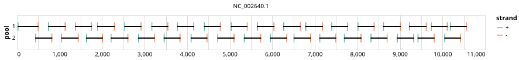

# yale-dev4 400bp v1.0.0


> If you use this scheme please cite: https://doi.org/10.1186/s12864-024-10350-x

> If you use this scheme please cite: https://dx.doi.org/10.17504/protocols.io.kqdg39xxeg25/v3

## Notes

Primer scheme for dengue virus serotype 4

Contact: grubaughlab@gmail.com

## Metadata

**Target Organisms:**
- dengue virus type 4 (Tax ID: 11070)

## Contributors

- Chantal Vogels
- Verity Hill
- Mallery I Breban
- Chrispin Chaguza
- Afeez Sodeinde
- Emma Taylor-Salmon
- Abigail J. Porzucek
- Nathan Grubaugh <grubaughlab@gmail.com>

## Overviews

<div style="width: 100%;"></div>

## Details

```json
{
    "schema_version": "1.0.0-alpha",
    "primer_scheme_name": "yale-dev4",
    "amplicon_size": 400,
    "primer_scheme_version": "v1.0.0",
    "primer_scheme_identifier": "yale-dev4/400/v1.0.0",
    "primer_scheme_contributor": [
        {
            "primer_scheme_contributor_name": "Chantal Vogels"
        },
        {
            "primer_scheme_contributor_name": "Verity Hill"
        },
        {
            "primer_scheme_contributor_name": "Mallery I Breban"
        },
        {
            "primer_scheme_contributor_name": "Chrispin Chaguza"
        },
        {
            "primer_scheme_contributor_name": "Afeez Sodeinde"
        },
        {
            "primer_scheme_contributor_name": "Emma Taylor-Salmon"
        },
        {
            "primer_scheme_contributor_name": "Abigail J. Porzucek"
        },
        {
            "primer_scheme_contributor_name": "Nathan Grubaugh",
            "primer_scheme_contributor_email": "grubaughlab@gmail.com"
        }
    ],
    "primer_scheme_target_organism": [
        {
            "primer_scheme_target_organism_name": "dengue virus type 4",
            "primer_scheme_target_organism_ncbi_taxon_id": "11070"
        }
    ],
    "primer_scheme_license": "CC-BY-SA-4.0",
    "primer_scheme_development_status": "VALIDATED",
    "primer_scheme_scope": [
        "WHOLE-GENOME"
    ],
    "citation": [
        "https://doi.org/10.1186/s12864-024-10350-x",
        "https://dx.doi.org/10.17504/protocols.io.kqdg39xxeg25/v3"
    ],
    "primer_scheme_details": [
        "Primer scheme for dengue virus serotype 4",
        "Contact: grubaughlab@gmail.com"
    ],
    "primer_scheme_generator": {
        "primer_scheme_generator_name": "primalscheme1"
    },
    "primer_scheme_checksums": {
        "primer_scheme_sha256": "3ae21a42327e5c8f63f155d923fef77079e355276081c6270853b57b17d261e3",
        "reference_sequence_sha256": "7fc0ca87876404224588badc3dd3b181610ec7bf3798336f82e1efdad3ae2c26"
    },
    "primer_scheme_creation_date": "2024-08-21",
    "primer_scheme_submission_date": "2026-09-01"
}
```


------------------------------------------------------------------------

This work is licensed under a [Creative Commons Attribution-ShareAlike 4.0 International License](http://creativecommons.org/licenses/by-sa/4.0/).

