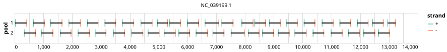

# yale-hmpv-a 400bp v1.0.0


## Metadata

**Target Organisms:**
- Human metapneumovirus A (Tax ID: 3037664)

## Contributors

- grubaugh-lab <grubaughlab@gmail.com>

## Overviews

<div style="width: 100%;"></div>

## Details

```json
{
    "schema_version": "1.0.0-alpha",
    "primer_scheme_name": "yale-hmpv-a",
    "amplicon_size": 400,
    "primer_scheme_version": "v1.0.0",
    "primer_scheme_identifier": "yale-hmpv-a/400/v1.0.0",
    "primer_scheme_contributor": [
        {
            "primer_scheme_contributor_name": "grubaugh-lab",
            "primer_scheme_contributor_email": "grubaughlab@gmail.com"
        }
    ],
    "primer_scheme_target_organism": [
        {
            "primer_scheme_target_organism_name": "Human metapneumovirus A",
            "primer_scheme_target_organism_ncbi_taxon_id": "3037664"
        }
    ],
    "primer_scheme_license": "CC-BY-SA-4.0",
    "primer_scheme_development_status": "DRAFT",
    "primer_scheme_checksums": {
        "primer_scheme_sha256": "707861117592cf236c241ac7d0160d98af5d1782495914b606a062de13bce66c",
        "reference_sequence_sha256": "a061b7467dcbd44a3c96eb4be121444de1d853a18653f10b6ea4e76b9cb36976"
    },
    "primer_scheme_submission_date": "2026-09-01"
}
```


------------------------------------------------------------------------

This work is licensed under a [Creative Commons Attribution-ShareAlike 4.0 International License](http://creativecommons.org/licenses/by-sa/4.0/).

