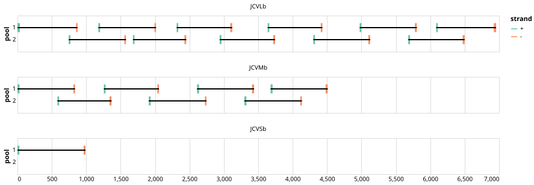

# yale-jcv-b 800bp v1.0.0


## Notes

Full genome sequencing of Jamestown Canyon virus (small, medium, and large segments) from pooled mosquitoes

## Metadata

**Target Organisms:**
- Jamestown Canyon virus (Tax ID: 35511)

## Contributors

- Ellie Bourgikos
- Mallery I Breban
- Alexander T. Ciota
- Chantal Vogels
- Philip M. Armstrong
- Nathan Grubaugh <grubaughlab@gmail.com>

## Overviews

<div style="width: 100%;"></div>

## Details

```json
{
    "schema_version": "1.0.0-alpha",
    "primer_scheme_name": "yale-jcv-b",
    "amplicon_size": 800,
    "primer_scheme_version": "v1.0.0",
    "primer_scheme_identifier": "yale-jcv-b/800/v1.0.0",
    "primer_scheme_contributor": [
        {
            "primer_scheme_contributor_name": "Ellie Bourgikos"
        },
        {
            "primer_scheme_contributor_name": "Mallery I Breban"
        },
        {
            "primer_scheme_contributor_name": "Alexander T. Ciota"
        },
        {
            "primer_scheme_contributor_name": "Chantal Vogels"
        },
        {
            "primer_scheme_contributor_name": "Philip M. Armstrong"
        },
        {
            "primer_scheme_contributor_name": "Nathan Grubaugh",
            "primer_scheme_contributor_email": "grubaughlab@gmail.com"
        }
    ],
    "primer_scheme_target_organism": [
        {
            "primer_scheme_target_organism_name": "Jamestown Canyon virus",
            "primer_scheme_target_organism_ncbi_taxon_id": "35511"
        }
    ],
    "primer_scheme_license": "CC-BY-SA-4.0",
    "primer_scheme_development_status": "TESTED",
    "primer_scheme_details": [
        "Full genome sequencing of Jamestown Canyon virus (small, medium, and large segments) from pooled mosquitoes"
    ],
    "primer_scheme_checksums": {
        "primer_scheme_sha256": "e460ed7996a7aa9d78208e434c2942c6cc4680146cdf09b857e7c613b52df502",
        "reference_sequence_sha256": "c209be0f933da79fc38be9c57d785d798bff024c02924dfde5d4176e63f9cb1b"
    },
    "primer_scheme_creation_date": "2026-02-24",
    "primer_scheme_submission_date": "2026-09-01"
}
```


------------------------------------------------------------------------

This work is licensed under a [Creative Commons Attribution-ShareAlike 4.0 International License](http://creativecommons.org/licenses/by-sa/4.0/).

