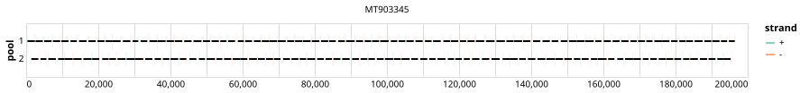

# yale-mpox 2000bp v1.0.0


> If you use this scheme please cite: https://dx.doi.org/10.17504/protocols.io.5qpvob1nbl4o/v4

## Metadata

**Target Organisms:**
- mpxv

## Contributors

- Nicholas F.G. Chen
- Luc Gagne
- Matthew Doucette
- Sandra Smole
- Erika Buzby
- Joshua Hall
- Stephanie Ash
- Rachel Harrington
- Seana Cofsky
- Selina Clancy
- Curtis J Kapsak
- Joel Sevinsky
- Kevin Libuit
- Mallery I Breban
- Chrispin Chaguza
- Nathan D. Grubaugh
- Daniel J. Park
- Glen R. Gallagher
- Chantal B.F. Vogels

## Vendors

- IDT: Yale hMPXV Amplicon Panel

## Overviews

<div style="width: 100%;"></div>

## Details

```json
{
    "schema_version": "1.0.0-alpha",
    "primer_scheme_name": "yale-mpox",
    "amplicon_size": 2000,
    "primer_scheme_version": "v1.0.0",
    "primer_scheme_identifier": "yale-mpox/2000/v1.0.0",
    "primer_scheme_contributor": [
        {
            "primer_scheme_contributor_name": "Nicholas F.G. Chen"
        },
        {
            "primer_scheme_contributor_name": "Luc Gagne"
        },
        {
            "primer_scheme_contributor_name": "Matthew Doucette"
        },
        {
            "primer_scheme_contributor_name": "Sandra Smole"
        },
        {
            "primer_scheme_contributor_name": "Erika Buzby"
        },
        {
            "primer_scheme_contributor_name": "Joshua Hall"
        },
        {
            "primer_scheme_contributor_name": "Stephanie Ash"
        },
        {
            "primer_scheme_contributor_name": "Rachel Harrington"
        },
        {
            "primer_scheme_contributor_name": "Seana Cofsky"
        },
        {
            "primer_scheme_contributor_name": "Selina Clancy"
        },
        {
            "primer_scheme_contributor_name": "Curtis J Kapsak"
        },
        {
            "primer_scheme_contributor_name": "Joel Sevinsky"
        },
        {
            "primer_scheme_contributor_name": "Kevin Libuit"
        },
        {
            "primer_scheme_contributor_name": "Mallery I Breban"
        },
        {
            "primer_scheme_contributor_name": "Chrispin Chaguza"
        },
        {
            "primer_scheme_contributor_name": "Nathan D. Grubaugh"
        },
        {
            "primer_scheme_contributor_name": "Daniel J. Park"
        },
        {
            "primer_scheme_contributor_name": "Glen R. Gallagher"
        },
        {
            "primer_scheme_contributor_name": "Chantal B.F. Vogels"
        }
    ],
    "primer_scheme_target_organism": [
        {
            "primer_scheme_target_organism_name": "mpxv"
        }
    ],
    "primer_scheme_license": "CC-BY-SA-4.0",
    "primer_scheme_development_status": "DRAFT",
    "citation": [
        "https://dx.doi.org/10.17504/protocols.io.5qpvob1nbl4o/v4"
    ],
    "primer_scheme_vendor": [
        {
            "primer_scheme_vendor_name": "IDT",
            "primer_scheme_vendor_kit_name": "Yale hMPXV Amplicon Panel"
        }
    ],
    "primer_scheme_checksums": {
        "primer_scheme_sha256": "6c94a47215a929d6688c706559e5f3cc4c75420cc7787cee7cfcb3df344a4cfe",
        "reference_sequence_sha256": "d89e86982a1c513206c4d219d20da23de32e98d4370a89eb928713d8ea9fd46a"
    }
}
```


------------------------------------------------------------------------

This work is licensed under a [Creative Commons Attribution-ShareAlike 4.0 International License](http://creativecommons.org/licenses/by-sa/4.0/).

