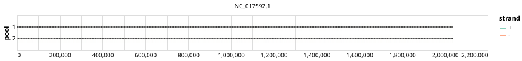

# yale-strep-pneumo 2000bp v1.0.0


## Notes

Primerscheme designed for the whole genome of Streptococcus pneumoniae

## Metadata

**Target Organisms:**
- Streptococcus pneumoniae (Tax ID: 1313)

## Contributors

- Freddy Gonzalez
- Isabella Distefano
- Chaney Kalinich
- Seth Redmond
- Nathan Grubaugh <grubaughlab@gmail.com>

## Overviews

<div style="width: 100%;"></div>

## Details

```json
{
    "schema_version": "1.0.0-alpha",
    "primer_scheme_name": "yale-strep-pneumo",
    "amplicon_size": 2000,
    "primer_scheme_version": "v1.0.0",
    "primer_scheme_identifier": "yale-strep-pneumo/2000/v1.0.0",
    "primer_scheme_contributor": [
        {
            "primer_scheme_contributor_name": "Freddy Gonzalez"
        },
        {
            "primer_scheme_contributor_name": "Isabella Distefano"
        },
        {
            "primer_scheme_contributor_name": "Chaney Kalinich"
        },
        {
            "primer_scheme_contributor_name": "Seth Redmond"
        },
        {
            "primer_scheme_contributor_name": "Nathan Grubaugh",
            "primer_scheme_contributor_email": "grubaughlab@gmail.com"
        }
    ],
    "primer_scheme_target_organism": [
        {
            "primer_scheme_target_organism_name": "Streptococcus pneumoniae",
            "primer_scheme_target_organism_ncbi_taxon_id": "1313"
        }
    ],
    "primer_scheme_license": "CC-BY-SA-4.0",
    "primer_scheme_development_status": "TESTED",
    "primer_scheme_scope": [
        "WHOLE-GENOME"
    ],
    "primer_scheme_details": [
        "Primerscheme designed for the whole genome of Streptococcus pneumoniae"
    ],
    "primer_scheme_generator": {
        "primer_scheme_generator_name": "primalscheme1"
    },
    "primer_scheme_checksums": {
        "primer_scheme_sha256": "8a94091de9de1d4120110405a7290dde2468bc699d939b2be35de38f686e12a9",
        "reference_sequence_sha256": "f20677cb93dcbd627adf2e494a95051915055b6b502f796be22f4a7d549e65ed"
    },
    "primer_scheme_creation_date": "2024-08-21",
    "primer_scheme_submission_date": "2026-09-01"
}
```


------------------------------------------------------------------------

This work is licensed under a [Creative Commons Attribution-ShareAlike 4.0 International License](http://creativecommons.org/licenses/by-sa/4.0/).

